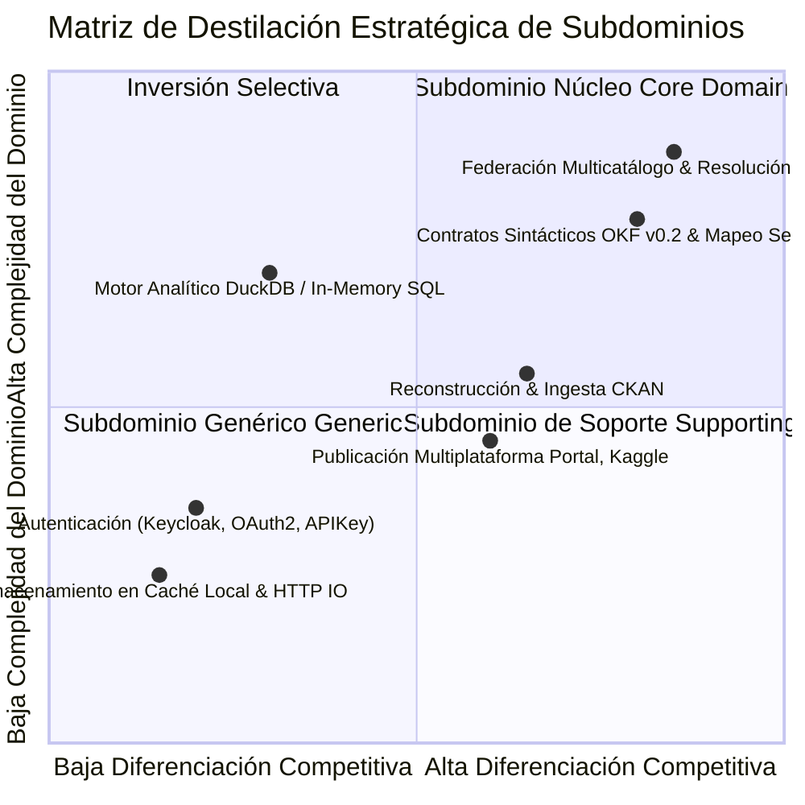
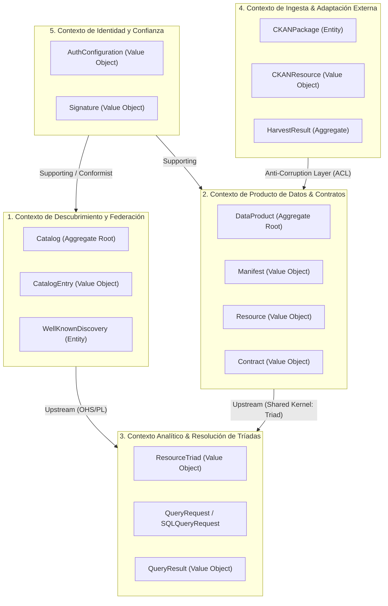

# Modelo de Dominio y Diseño Estratégico (Domain-Driven Design)

Este documento formaliza el modelo de dominio del **DataMesh SDK** bajo la metodología **Domain-Driven Design (DDD)** establecida por Eric Evans. Define el Lenguaje Ubicuo, los Límites de Contexto (Bounded Contexts), el Mapa de Contextos (Context Map), los Agregados, Entidades, Objetos de Valor (Value Objects), Eventos de Dominio y la Destilación Estratégica del Núcleo.

---

## 1. Declaración de Visión del Dominio (Domain Vision Statement)

El **Core Domain** de DataMesh SDK es la **Federación Soberana Descentralizada y Resolución de Conocimiento Abierto (OKF/ODKF v0.2)**. 

A diferencia de los data lakes monolíticos centralizados o almacenes analíticos propietarios, DataMesh SDK permite que cualquier organización, portal gubernamental, repositorio Git o portal CKAN publique datos soberanos documentados bajo estándares abiertos, resolviendo productos de datos heterogéneos (CSV, Parquet, TSV, JSON, SDMX) y ejecutando consultas SQL federadas instantáneas sin requerir infraestructura central ni ingestiones forzadas.

---

## 2. Lenguaje Ubicuo (Ubiquitous Language)

El siguiente glosario establece los términos estrictos compartidos entre los expertos del dominio de datos abiertos, la especificación normativa OKF v0.2 y el código del SDK:

| Término Ubicuo | Definición de Negocio | Representación en Código (Go / Python) |
| :--- | :--- | :--- |
| **Data Product** (Producto de Datos) | Agregado raíz que representa una unidad autónoma y gobernada de datos, metadatos, contratos y trazabilidad. | `domain.DataProduct` / `datamesh.domain.models.DataProduct` |
| **Canonical Triad** (Tríada Canónica) | Dirección universal soberana para identificar inequívocamente cualquier recurso en la malla: `[catalogo:]dataset:recurso`. | `domain.ResourceTriad` / `ResourceTriad` |
| **Sovereign Catalog** (Catálogo Soberano) | Colección federada y autónoma de productos de datos indexados mediante `llms.txt` o APIs de descubrimiento. | `domain.Catalog` / `WellKnownDiscovery` |
| **Catalog Entry** (Entrada de Catálogo) | Descriptor liviano de un Data Product dentro de un catálogo para descubrimiento y búsqueda. | `domain.CatalogEntry` |
| **Syntactic Contract** (Contrato Sintáctico) | Especificación ejecutable de la estructura física y tipos de columnas (Frictionless `datapackage.yaml`/JSON, DSD SDMX). | `domain.Contract`, `PackageManifest` |
| **Semantic Mapping** (Mapeo Semántico) | Vinculación explícita de campos tabulares a conceptos ontológicos SKOS/Wikidata o archivos Markdown locales. | `domain.SemanticFieldMapping` |
| **Quality Profile** (Perfil de Calidad) | Reglas de validación declarativas y métricas de completitud y observabilidad del dataset. | `domain.QualityProfile`, `QualityCheckRule` |
| **Cryptographic Trust** (Confianza Criptográfica)| Garantía de autoría e inmutabilidad mediante firmas SSH/OpenPGP y checksums SHA-256 (PE4). | `domain.Signature`, `domain.Resource.HashSHA256` |
| **Harvester** (Recolector) | Proceso de extracción y reconstrucción de catálogos legados (CKAN) hacia especificaciones OKF v0.2. | `domain.CKANHarvestResult`, `HarvestCKANUseCase` |
| **Well-Known Discovery** | Protocolo de anuncio de capacidades, tipos de catálogo y esquemas de autenticación (`/.well-known/datamesh.json`). | `domain.WellKnownDiscovery`, `CatalogMetadata` |

---

## 3. Destilación Estratégica (Strategic Design)

Para enfocar el máximo esfuerzo de ingeniería y rigor en el valor diferenciador, el sistema clasifica sus subdominios:



### Clasificación de Subdominios:
1. **Core Domain (Núcleo):**
   - **Federación Soberana y Resolución de Tríadas Canónicas**: Resolución de `catalogo:dataset:resource` a través de múltiples fuentes descentralizadas sin acoplamiento central.
   - **Modelado de Productos de Datos y Contratos OKF v0.2**: Abstracción unificada de metadatos, calidad, cobertura espacial/temporal y alineación semántica.
2. **Supporting Subdomains (Soporte):**
   - **Harvester de Catálogos Legados (CKAN)**: Adaptación de catálogos existentes hacia la red abierta.
   - **Publicador Multiplataforma**: Generación de artefactos para Git, Kaggle Datasets y portales web.
3. **Generic Subdomains (Genéricos):**
   - **Autenticación y Seguridad**: Integración estándar con Keycloak, tokens OAuth2 y headers de API Key (delegado a estándares IETF).
   - **Motor de Consultas SQL**: Ejecución analítica delegada a DuckDB o motor columnar en memoria.
   - **Caché y Almacenamiento Local**: Manejo de archivos en `~/.datamesh/cache`.

---

## 4. Bounded Contexts y Mapa de Contextos (Context Map)

El sistema se divide estrictamente en 5 Bounded Contexts con fronteras lingüísticas y modelos aislados:



### Patrones de Relación en el Context Map:
- **Product Context → Analytical Context (Shared Kernel):** Comparten el Value Object `ResourceTriad` para direccionar datasets y tablas analíticas.
- **Harvesting Context → Product Context (Anti-Corruption Layer - ACL):** `HarvestCKANUseCase` y `CKANClientAdapter` traducen los esquemas propietarios de CKAN Action API y DataStore hacia entidades puras de `DataProduct` y contratos `datapackage.yaml`, evitando que el modelo de CKAN contamine el núcleo.
- **Discovery Context → Analytical Context (Open Host Service / Published Language):** Expone `domain.Catalog` e índices `llms.txt` normalizados para que el motor analítico resuelva ubicaciones físicas sin conocer los detalles de transporte de cada servidor.
- **Security Context → Harvesting/Discovery Context (Conformist):** Se adapta a las especificaciones OAuth2 / OpenID Connect de Keycloak sin reinventar primitivas criptográficas.

---

## 5. Tácticas de Dominio: Agregados, Entidades y Objetos de Valor

### 5.1. Aggregate: `DataProduct`
- **Root Entity:** `domain.DataProduct`
- **Invariantes:**
  1. `Title` no puede estar vacío ni contener sólo espacios en blanco.
  2. `Type` debe ser un tipo normativo reconocido (`dataset`, `model`, `composite`, `component`, `requirement`).
  3. `Dimensions` debe contener al menos una dimensión de clasificación (ej. `core`, `fiscal`, `reservas`).
  4. Los `Contracts` deben tener rutas sintácticas válidas y no colisionar entre esquemas incompatibles.
- **Métodos de Negocio:**
  - `Validate() error`: Verifica las invariantes antes de persistir o procesar el nodo.
  - `FindResource(name string) (*Resource, error)`: Recupera un recurso tabular por nombre o alias.

### 5.2. Value Object: `ResourceTriad`
- **Inmutabilidad:** Totalmente inmutable una vez instanciado.
- **Atributos:** `Catalog` (opcional), `Dataset`, `Resource`.
- **Comportamiento Autónomo:**
  - `String()`: Representación canónica `[catalog:]dataset:resource`.
  - `FullURI()`: URI estándar `datamesh://[catalog/]dataset/resource`.
  - `ToSQLIdentifier()`: Genera identificadores limpios y libres de colisiones para motores SQL.
  - `Matches(other)`: Comparación insensible a mayúsculas/minúsculas y acentos.

### 5.3. Aggregate: `Catalog`
- **Root Entity:** `domain.Catalog`
- **Invariantes:**
  1. `SourceURL` debe ser una dirección válida (`file://`, `http://`, `https://`, `federated://`).
  2. No admite entradas duplicadas para la misma URL de Data Product resuelta.
- **Métodos de Negocio:**
  - `FindByKeyword(kw string) []CatalogEntry`: Búsqueda sobre título, descripción y dominio.
  - `FindByDomain(domain string) []CatalogEntry`: Filtrado categórico.

---

## 6. Eventos de Dominio (Domain Events)

Para desacoplar la orquestación e implementar auditoría y trazabilidad, el modelo define eventos inmutables en tiempo pasado:

| Evento | Cuándo Ocurre | Datos Clave (Payload) | Receptores / Efecto |
| :--- | :--- | :--- | :--- |
| `CatalogDiscovered` | Al concluir la lectura y deduplicación de un catálogo federado. | `CatalogURL`, `EntryCount`, `DiscoveredAt` | Actualiza índice de descubrimiento en memoria. |
| `DataProductResolved` | Al parsear y validar satisfactoriamente un nodo OKF v0.2. | `ProductID`, `ManifestType`, `ResourceCount` | Registra el nodo en el catálogo local y caché. |
| `CKANPackageHarvested`| Al convertir un dataset de CKAN a bundle OKF v0.2. | `PackageID`, `Triad`, `ResourceFormats` | Genera `datapackage.yaml` e `index.md`. |
| `TriadResolved` | Al traducir una tríada canónica a ruta física local o remota. | `Triad`, `PhysicalURI`, `Format` | Configura el motor analítico DuckDB con alias. |
| `SecurityVerified` | Al validar con éxito la firma criptográfica SSH/PGP. | `KeyID`, `Algorithm`, `Fingerprint` | Marca el producto como "verificado/oficial". |

---

## 7. Capa Anticorrupción (ACL) para Integraciones Externas

El patrón ACL protege la integridad del dominio frente a modelos externos inestables o heredados:

```text
 [ Sistema Externo ]               [ Capa Anticorrupción (ACL) ]              [ Dominio DataMesh ]
 
 CKAN Action API v3  -------->   CKANClientAdapter                       
 (package_search)                - Parsea JSON externo                   
                                 - Mapea DataStore fields                
                                 - Filtra atributos irrelevantes         
                                           |                             
                                           v                             
                                 HarvestCKANUseCase                      
                                 - Reconstruye datapackage.yaml ---------> DataProduct Aggregate
                                 - Reconstruye index.md                  - Invariantes OKF v0.2
                                 - Valida contratos sintácticos
```

---

## 8. Diagnóstico y Evaluación del Modelo (DDD Scorecard)

Evaluación del modelo del SDK conforme al checklist de Domain-Driven Design:

| Criterio Diagnóstico | Cumplimiento | Evidencia en el Código |
| :--- | :---: | :--- |
| **1. Lenguaje Ubicuo en Código** | **Sí (1/1)** | Clases nombradas según el dominio: `DataProduct`, `ResourceTriad`, `CatalogEntry`, `WellKnownDiscovery`, `QualityProfile`. Cero clases `Manager` o `DataProcessor`. |
| **2. Límites de Contexto Explícitos** | **Sí (1/1)** | Separación de contextos de Descubrimiento, Producto, Analítico, Ingesta y Seguridad. |
| **3. Agregados Pequeños y Consistentes**| **Sí (1/1)** | `DataProduct` y `Catalog` tienen límites transaccionales claros; las referencias cruzadas se realizan por URI/Tríada, no por punteros a otros agregados. |
| **4. Objetos con Comportamiento** | **Sí (1/1)** | `DataProduct.Validate()`, `ResourceTriad.ToSQLIdentifier()`, `Catalog.FindByKeyword()`. No son simples bolsas anémicas de datos. |
| **5. Capa Anticorrupción (ACL)** | **Sí (1/1)** | `CKANClientAdapter` y `WellKnownResolverAdapter` aíslan completamente al dominio de las respuestas heterogéneas de CKAN y Keycloak. |
| **6. Identificación de Core Domain** | **Sí (1/1)** | Foco absoluto en la resolución de tríadas canónicas y contratos federados OKF v0.2; autenticación y SQL delegados a puertos secundarios. |
| **7. Modelo Rico en Core Domain** | **Sí (1/1)** | Validación estructural, mapeo ontológico SKOS/Wikidata, perfiles de calidad Frictionless y soporte jerárquico de requerimientos. |

**Puntuación Total de Calidad DDD: 10 / 10.**
